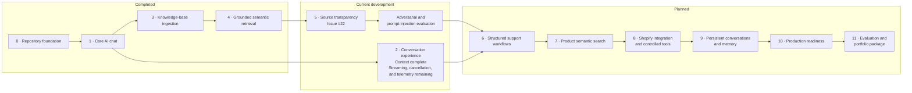

# E-commerce AI Support Assistant

A production-oriented AI assistant for e-commerce businesses that helps customers and support teams find reliable answers about products, shipping, returns, and store policies. The application will combine conversational AI with controlled business data so responses can be grounded, cited, and safely connected to live store tools.

## Technology stack

- Next.js and React
- NestJS
- TypeScript
- OpenAI Responses and Embeddings APIs
- Qdrant vector database
- Nx monorepo tooling
- PostgreSQL planned for persistent application data

## Project status

**Knowledge-base RAG with source transparency in progress**

The application now provides a full-stack chat experience, bounded multi-turn
context, deterministic Markdown ingestion, OpenAI embeddings, Qdrant vector
synchronization, semantic retrieval, grounded responses, and a live retrieval
evaluation suite. The current increment adds safe knowledge-base source metadata
to API responses and displays it beneath assistant messages.

See the [project plan](./PROJECT_PLAN.md) for the original milestone definitions,
architecture, acceptance criteria, and delivery principles.

## Roadmap

The roadmap reflects the actual delivery order. Each phase should remain a
small, reviewable increment with automated checks and an observable behavior
change.

| Phase                                    | Outcome                                                                                                                                                  | Status                                                                                                 |
| ---------------------------------------- | -------------------------------------------------------------------------------------------------------------------------------------------------------- | ------------------------------------------------------------------------------------------------------ |
| 0. Repository foundation                 | Independently runnable Next.js and NestJS applications, environment protection, health checks, linting, tests, and builds                                | Complete                                                                                               |
| 1. Core AI chat                          | Validated chat endpoint, server-side OpenAI Responses API integration, safe errors, and responsive chat interface                                        | Complete                                                                                               |
| 2. Conversation experience               | Bounded multi-turn context is complete; streaming, cancellation, usage telemetry, and request-duration logging remain                                    | In progress                                                                                            |
| 3. Knowledge-base ingestion              | Version-controlled Markdown loading, deterministic chunking and hashing, embeddings, idempotent Qdrant synchronization, and stale-vector deletion        | Complete                                                                                               |
| 4. Grounded semantic retrieval           | Query embeddings, thresholded vector search, validated context, honest fallback behavior, and live retrieval evaluation                                  | Complete                                                                                               |
| 5. Source transparency                   | Return safe source metadata with grounded responses and display accessible source cards in the chat UI                                                   | In progress — [issue #22](https://github.com/alireza-sohrabi/ecommerce-ai-support-assistant/issues/22) |
| 6. Structured support workflows          | Classify support requests and generate schema-validated response drafts that require human review                                                        | Planned                                                                                                |
| 7. Product data and semantic search      | Add synthetic product storage, embeddings, metadata filters, natural-language search, and retrieval evaluation                                           | Planned                                                                                                |
| 8. Shopify and controlled business tools | Connect Shopify for read-only product, inventory, order, and fulfillment lookup; add approval-gated write actions with validation and strict step limits | Planned                                                                                                |
| 9. Persistent conversations and memory   | Store conversations safely, isolate users, summarize history, retrieve relevant preferences, and support inspection and deletion                         | Planned                                                                                                |
| 10. Production readiness                 | Add authentication, authorization, rate limits, secure headers, retries, timeouts, observability, migrations, and deployment configuration               | Planned                                                                                                |
| 11. Evaluation and portfolio package     | Expand adversarial and answer-quality evaluation, document architecture and tradeoffs, and create demo and portfolio material                            | Planned                                                                                                |



### Immediate next steps

1. Complete and merge source metadata and UI cards for issue #22.
2. Add adversarial retrieval and prompt-injection evaluation cases.
3. Finish streaming, cancellation, and request telemetry.
4. Implement structured support classification and draft generation.

## Repository structure

```text
apps/
  web/    Next.js frontend
  api/    NestJS backend
```

Nx manages the applications, task orchestration, and build caching. The frontend and backend remain independently runnable and deployable.

The API follows a ports-and-adapters structure:

```text
apps/api/src/app/
  features/       Business use cases such as chat and knowledge-base ingestion
  ports/          Provider-neutral AI, embedding, and vector-database contracts
  integrations/   OpenAI and Qdrant adapters plus runtime port bindings
```

Features depend on ports, integrations implement ports, and the root application
module composes both layers.

## Prerequisites

- Node.js 24
- npm 11

The repository includes `.nvmrc` and enforces the supported Node.js major version during package installation.

## Environment configuration

Create a root `.env` file from `.env.example`, then provide your OpenAI API key and model:

```dotenv
OPENAI_API_KEY=your-api-key
OPENAI_MODEL=your-model
OPENAI_EMBEDDING_MODEL=text-embedding-3-small
OPENAI_EMBEDDING_DIMENSIONS=1536
QDRANT_ENDPOINT=http://localhost:6333
QDRANT_API_KEY=your-qdrant-api-key
KNOWLEDGE_BASE_VECTOR_COLLECTION=knowledge-base
KNOWLEDGE_BASE_RETRIEVAL_LIMIT=4
KNOWLEDGE_BASE_RETRIEVAL_SCORE_THRESHOLD=0.4
WEB_ORIGIN=http://localhost:3000
```

Create `apps/web/.env.local` from `apps/web/.env.example`:

```dotenv
NEXT_PUBLIC_API_BASE_URL=http://localhost:3001
```

The OpenAI and Qdrant API keys must remain in the root server environment and
must never be added to the frontend environment. `QDRANT_ENDPOINT` must be an
absolute HTTP or HTTPS URL. The API validates both Qdrant settings during
startup; use a dedicated, least-privilege API key for the target Qdrant
instance.

`OPENAI_EMBEDDING_DIMENSIONS` must match the vector size used by the
knowledge-base Qdrant collection. Changing the embedding model or dimensions
after creating the collection requires a new collection name or an explicit
collection migration.

`KNOWLEDGE_BASE_RETRIEVAL_LIMIT` caps the number of chunks supplied to chat
generation. `KNOWLEDGE_BASE_RETRIEVAL_SCORE_THRESHOLD` accepts a value from
`0` to `1`; results below it are excluded. The default `0.4` is an initial
cosine-similarity cutoff calibrated against the repository's retrieval
evaluation cases. Similarity is a ranking signal rather than a confidence
percentage, so rerun the evaluation after changing the embedding model,
chunking, source content, or threshold.

## Local development

Install dependencies from the repository root:

```bash
npm install
```

Start the Next.js frontend at `http://localhost:3000`:

```bash
npm run dev:web
```

Start the NestJS API at `http://localhost:3001`:

```bash
npm run dev:api
```

The API health endpoint is available at `http://localhost:3001/api/health`.

Grounded chat responses include safe source metadata:

```json
{
  "reply": "Standard shipping takes 3–7 business days after dispatch.",
  "sources": [
    {
      "documentTitle": "Shipping Policy",
      "sectionTitle": "Delivery options",
      "sourcePath": "policies/shipping.md"
    }
  ]
}
```

The API does not return retrieved content, embeddings, similarity scores,
content hashes, vector point IDs, or vector-database details.

## Debugging the API

Open the repository root in VS Code, add breakpoints in the API TypeScript
source, and run **API: Launch and debug** from the Run and Debug panel. This
starts the Nx development server under the Node debugger, pauses before
application startup, loads the root `.env`, and maps the webpack output back to
the original TypeScript files.

Useful breakpoints for following the grounded chat flow are:

- `ChatController.chat`
- `ChatService.processMessage`
- `KnowledgeBaseRetrievalService.retrieve`
- `OpenAIEmbeddingService.generateEmbeddings`
- `QdrantService.search`
- `OpenAIService.generateResponse`

To start the debuggable process separately:

```bash
npm run debug:api
```

Then select **API: Attach to port 9229** in VS Code. The process initially
pauses until the debugger attaches. Stop the Nx terminal when the debugging
session is complete.

## Knowledge-base synchronization

Version-controlled Markdown sources live under
`apps/api/content/knowledge-base/`. To synchronize them with Qdrant:

```bash
npm run sync:knowledge-base
```

The command creates the configured collection when necessary, embeds and
upserts only new or changed chunks, deletes stale points, and prints a concise
summary. Re-running it with unchanged source files performs no embedding or
vector writes.

## Knowledge-base retrieval evaluation

After synchronizing the knowledge base, run the live retrieval evaluation:

```bash
npm run evaluate:knowledge-base-retrieval
```

The command embeds a small version-controlled set of supported and unsupported
questions, searches the configured Qdrant collection, and verifies the expected
source sections. It prints section metadata and a pass/fail summary without
printing embeddings, credentials, or complete document content. It uses live
OpenAI and Qdrant services, so it is intentionally separate from routine unit
tests.

## Validation

```bash
npm run lint
npm test
npm run build
```
